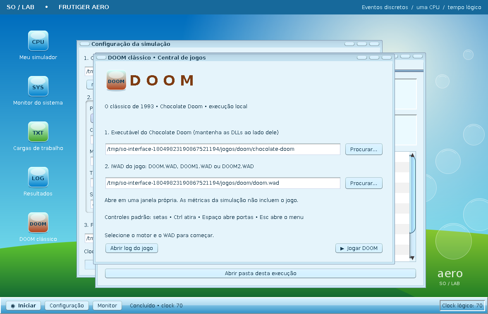

# Integração com DOOM

O projeto possui um lançador opcional para o Chocolate Doom. Essa parte foi adicionada como recurso de demonstração da interface e não faz parte do núcleo acadêmico do simulador.

O Chocolate Doom é executado como um processo real do Windows ou Linux. Portanto, ele não passa pelo escalonador, pela memória paginada ou pelos dispositivos simulados. As métricas do trabalho não são alteradas pela execução do jogo.

## Arquivos necessários

Para usar o recurso é preciso ter:

- a distribuição do Chocolate Doom;
- um IWAD válido, como `DOOM.WAD`, `DOOM1.WAD` ou `DOOM2.WAD`;
- opcionalmente, um PWAD/mod compatível com o IWAD escolhido.

Os arquivos do jogo não fazem parte do repositório.

## Preparação no Windows

Na raiz do projeto, informe a pasta do Chocolate Doom e o IWAD:

```powershell
powershell -ExecutionPolicy Bypass -File scripts\preparar-doom.ps1 -PastaMotor "C:\Jogos\ChocolateDoom" -Wad "C:\Jogos\DOOM\DOOM2.WAD"
```

O script copia os arquivos necessários para `jogos/doom`, verifica a presença do executável e faz uma validação básica do WAD.

Depois disso, abra a interface e use o atalho **DOOM clássico**.



## Como a integração funciona

`PainelDoom` reúne os campos e botões da interface. A classe `Doom` monta a linha de execução e inicia o motor por `ProcessBuilder`. Um `SwingWorker` acompanha o processo sem travar o desktop do simulador.

A tela permite selecionar manualmente o executável, o IWAD e, quando necessário, um PWAD. A escolha feita na interface vale para aquela execução.

## Limites

Este recurso não transforma o simulador em um sistema operacional real. O Windows ou Linux continua responsável por criar o processo do jogo, acessar arquivos, usar vídeo, áudio, teclado e demais recursos de hardware.

Da mesma forma, alterar quantum, política de escalonamento ou número de molduras no simulador não muda o desempenho do Chocolate Doom. São dois fluxos separados.
