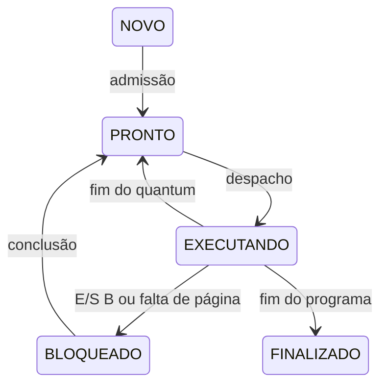

# Guia de estudo e apresentação do simulador de SO

Este guia explica o código desta pasta, com alvo Java 21, e inclui execuções reproduzidas em 19/09/2026. Os exemplos e números foram conferidos no programa. O enunciado original `Trabalho SO.pdf` não está no workspace: a conferência de requisitos abaixo usa `requisitos.md`, não substitui a leitura do PDF do professor.

## 1. Como apresentar o projeto corretamente

Uma descrição defensável é:

> Desenvolvemos um simulador didático de mecanismos de sistemas operacionais, orientado a eventos discretos. Ele representa processos, threads, escalonamento de uma CPU, paginação FIFO, dispositivos de E/S e um sistema de arquivos em memória. Cada execução produz eventos e métricas reproduzíveis, consultáveis pela CLI ou pela interface gráfica.

O programa é uma aplicação Java executada pelo sistema operacional do computador. A aparência de desktop é uma interface Swing. Não existe inicialização da máquina pelo nosso kernel, execução em modo privilegiado ou controle direto do hardware.

O trabalho tem valor porque permite observar e comparar políticas sob regras explícitas: quem executa, por quanto tempo, por que bloqueia, como retorna à fila e quanto isso custa. A fidelidade deve ser avaliada em relação ao modelo e ao enunciado, não pela aparência da interface.

O Doom é uma integração adicional: o lançador Java inicia o Chocolate Doom como processo real do Windows. Ele não passa pela CPU nem pela memória simuladas.

## 2. O que é real e o que é simulado

```text
Hardware do computador
└── Windows: CPU, memória, arquivos reais, drivers, vídeo e áudio
    ├── Runtime Java / JVM
    │   └── Simulador SO
    │       ├── Interface Swing
    │       └── Modelo: processos, threads, CPU, páginas e dispositivos
    └── Chocolate Doom, iniciado pelo lançador Java
        └── Dados do jogo: doom2.wad
```

| Elemento | Neste projeto | Em um SO real de uso geral |
|---|---|---|
| Processo | Objeto `Processo` dentro da JVM | Entidade administrada pelo kernel, com recursos e espaço de endereçamento |
| Thread | Objeto `ThreadSimulada` com estado e instruções | Contexto executável que o sistema pode despachar em um núcleo |
| CPU | Referência `executando` e eventos de duração 1 | Processador que executa instruções de máquina |
| Registrador | Campo numérico `acumulador` | Estado arquitetural do processador |
| Pilha | `Deque<Long>` | Região de memória usada pela execução e convenção de chamadas |
| Clock | Contador `long` em unidades lógicas | Relógios, temporizadores e mecanismos de medição do hardware/SO |
| Paginação | Tabelas e molduras representadas por objetos | Tradução de endereços e proteção, normalmente com MMU e tabelas configuradas pelo kernel |
| Interrupção | Ação agendada na fila de eventos | Transferência de controle provocada por hardware ou mecanismo arquitetural |
| Disco/terminal | Filas com serviço de duração fixa | Dispositivos e drivers com operações e tempos concretos |
| Arquivo simulado | Nó, texto e blocos em estruturas Java | Conteúdo e metadados geridos pelo sistema de arquivos do hospedeiro |
| Interface | Janelas internas Swing | Aplicações, serviços gráficos e gerenciador de janelas da plataforma |

Os arquivos de carga e os CSVs/logs são arquivos reais do computador. Já um arquivo criado por `CRIAR /dados/a.txt rw` existe apenas no objeto `Arquivos` daquela simulação. Reiniciar a simulação cria um novo volume vazio.

O núcleo modelado é sequencial. A aplicação pode ter threads reais da JVM, da interface, do `SwingWorker` e do runtime. Isso não transforma `ThreadSimulada` em uma thread do Windows.

## 3. Por que Java é uma escolha adequada

Sem o enunciado original, não é possível afirmar que Java foi exigido. A justificativa técnica compatível com esta implementação é:

1. Classes representam diretamente PCB, TCB, memória, dispositivos e arquivos.
2. Coleções prontas permitem escrever filas e tabelas sem construir toda a infraestrutura de armazenamento.
3. Tipagem estática e exceções ajudam a detectar inconsistências e validar entradas.
4. A gestão automática da memória real reduz o trabalho com ponteiros e desalocação durante a construção de um modelo didático.
5. Swing oferece uma interface local usando a biblioteca padrão.
6. O código pode executar em plataformas com um runtime compatível; a distribuição Windows contém seu próprio runtime.
7. O tempo da simulação é lógico: uma pausa do coletor de lixo pode atrasar a execução real do programa, mas não acrescenta unidades ao clock simulado.

O alvo atual é Java 21, sem recursos preview. Não apresente JDK 27 como requisito: existem documentos históricos que o mencionam, mas os scripts atuais usam `--release 21`.

O percurso de execução é:

```text
Fontes .java → javac → bytecode .class → JAR → JVM → instruções executadas no computador
```

JDK é o conjunto de desenvolvimento, com compilador e ferramentas. A JVM executa o formato de classes e o runtime fornece os serviços necessários à aplicação. A especificação da JVM admite diferentes implementações; não determina que toda execução seja interpretação linha a linha. Veja a [especificação da JVM, seção 1.2](https://docs.oracle.com/javase/specs/jvms/se21/html/jvms-1.html#jvms-1.2).

`jpackage` cria lançadores e organiza o JAR com um runtime. Neste projeto, `SimuladorSO.exe` inicia a aplicação com a JVM incluída. Isso não converte o simulador em kernel nem em sistema inicializável.

## 4. É possível fazer um SO em Java?

Sim. A frase “não dá para fazer SO em Java” é absoluta e incorreta. Há projetos como [JNode](https://github.com/jnode/jnode), cujo repositório contém máquina virtual, kernel, infraestrutura de drivers e geração de imagem inicializável.

A dificuldade é construir a infraestrutura que uma aplicação Java comum já recebe do sistema hospedeiro. Para funcionar diretamente sobre a máquina, a plataforma precisa resolver inicialização, acesso ao hardware, tratamento de interrupções, memória física, alocação, execução de código e os serviços exigidos pelo runtime.

Uma solução pode combinar runtime próprio, compilação antecipada, primitivas especiais e uma parte de baixo nível em Assembly ou outra linguagem. Coleta de lixo, carregamento de classes e restrições de latência exigem escolhas cuidadosas; não constituem uma prova de impossibilidade.

Neste projeto há dependência concreta do hospedeiro: `Files` usa seus arquivos; Swing usa sua infraestrutura gráfica; `ProcessBuilder` pede que ele crie processos. Copiar o JAR para um pendrive inicializável não fornece esses serviços.

Uma resposta adequada ao professor é:

> Java pode participar da implementação de um sistema operacional quando existe infraestrutura preparada para isso. Nosso projeto usa Java como aplicação hospedada para simular mecanismos de SO. Transformá-lo em um SO inicializável exigiria implementar essa infraestrutura e vários mecanismos que hoje são apenas modelos.

## 5. O que mudaria em outra linguagem

É necessário distinguir reescrever este simulador de criar um kernel.

| Linguagem | Para reescrever o simulador | Para construir um kernel |
|---|---|---|
| C | `struct`, filas, tabelas e gestão explícita de memória; interface gráfica exigiria outra solução | Permite um ambiente sem biblioteca padrão hospedada; ainda exige boot, drivers, interrupções e controle da máquina |
| C++ | Classes e contêineres podem representar o mesmo modelo | É preciso escolher quais recursos do runtime estarão disponíveis e implementar as dependências usadas |
| Rust | Estruturas, enums e coleções; regras de propriedade influenciam as referências entre objetos | Pode usar `no_std`; acesso a hardware e algumas fronteiras exigem código específico e, quando necessário, `unsafe` |
| Python | Estruturas e filas podem expressar os mesmos algoritmos com facilidade | Uma aplicação Python usual depende de interpretador e serviços hospedados; isso não resolve o problema de inicialização |
| Java | Já fornece os mecanismos usados pelo projeto e Swing | Exige uma plataforma capaz de executar o código e atender suas operações sem depender de um SO prévio |

Se a reescrita preservar a carga, os desempates, os custos e as fórmulas, os resultados lógicos devem ser iguais. O tempo real para calculá-los e o consumo de memória real podem mudar.

Reescrever em C não faz o programa passar a administrar automaticamente a máquina. O objetivo e a infraestrutura determinam se o resultado é um simulador ou um kernel.

## 6. Mapa dos arquivos Java

Todos os fontes estão em `src/so`.

| Classe | Responsabilidade e pontos para explicar |
|---|---|
| `Main` | Entrada da CLI; `executar` coordena carga, validação, simulação e gravação; compartilhado com a GUI |
| `Configuracao` | `record` dos parâmetros; `ler` valida opções, valores e padrões |
| `Carga` | Analisa o arquivo textual, cria processos/threads/instruções e valida estrutura e sintaxe |
| `Instrucao` | `record` com operação, argumentos e linha original para diagnóstico |
| `Evento` | `record` com instante, tipo, sequência e ação; `compareTo` define a ordem temporal |
| `Estado` | Enum dos cinco estados e das transições permitidas para threads |
| `Processo` | PCB: identidade, prioridade, páginas, threads, descritores e estado agregado |
| `ThreadSimulada` | TCB: programa, PC, acumulador, pilha, restante do surto, estado e contadores de métricas |
| `Escalonador` | Mantém a fila de prontas, ordenada conforme FCFS/RR/prioridade |
| `Simulador` | Núcleo dos eventos: admissão, troca, despacho, execução, bloqueio, preempção e encerramento |
| `Memoria` | Tradução de endereços, faltas, serviço do paginador e substituição FIFO global |
| `Dispositivo` | Requisições B/NB, fila FCFS, serviço e entrega de conclusões |
| `Arquivos` | Árvore de diretórios, blocos de conteúdo, permissões e tabelas de abertura |
| `Metricas` | Constrói os três CSVs com fórmulas uniformes |
| `InterfaceGrafica` | Formulário, atalhos, execução em `SwingWorker` e apresentação dos resultados |
| `LinhaTempo` | Converte eventos já concluídos em barras de CPU e troca de contexto |
| `TemaAero` | Desenho e aparência; não participa dos algoritmos de SO |
| `PainelDoom` | Seleção dos arquivos, botão de jogo, acompanhamento da execução e abertura do log |
| `Doom` | Validação estrutural dos WADs e criação do processo externo |

As três classes de teste são `Testes`, `TestesInterface` e `TestesDoom`.

`record` evita código repetitivo para transportar dados. Ele não implica imutabilidade profunda de qualquer objeto referenciado. `enum` restringe os estados e políticas a valores conhecidos. `final` impede nova atribuição da referência, mas uma coleção `final` ainda pode receber elementos.

`PriorityQueue<Evento>` fornece a próxima ação na ordem definida por `compareTo`. A fila de prontas também usa `PriorityQueue`, com outro comparador. `ArrayDeque` serve às filas FIFO e à pilha. `TreeMap` mantém os filhos de diretório em ordem alfabética. `LinkedHashMap` mantém uma ordem estável de iteração das tabelas em que foi adotado.

Uma expressão como `() -> admitir(processo)` guarda uma ação. Mais tarde, `.run()` a executa no fluxo atual. Não é uma chamada a `Thread.start()` e não cria execução paralela real.

## 7. Da entrada ao resultado

1. A CLI recebe opções ou a GUI transforma os campos em opções equivalentes.
2. `Configuracao.ler` exige uma carga, rejeita opções desconhecidas/repetidas e valida números.
3. `Carga.ler` percorre o texto UTF-8 e constrói os objetos.
4. `Main.validarEnderecos` verifica cada `MEM` considerando páginas do processo e tamanho de página.
5. `Main.executar` recusa uma pasta de saída que já contenha arquivos.
6. Um novo `Simulador` cria a CPU lógica, escalonador, memória, volume e dispositivos.
7. `simular` agenda as chegadas e processa eventos até concluir o trabalho.
8. O núcleo verifica se todos os processos terminaram.
9. `Main` grava `eventos.log`, `resumo.csv`, `threads.csv` e `processos.csv`.
10. A GUI lê os resultados do objeto concluído e monta suas abas.

A GUI gera uma subpasta nova por execução. A CLI usa o caminho solicitado. O núcleo não permite executar novamente a mesma instância de `Simulador`; uma repetição deve criar novos processos e novo simulador, evitando reutilização de estado.

Há dois tipos principais de erro. Uma carga malformada impede a simulação. Uma falha de operação modelada, como ler descritor fechado, é registrada como `ERRO_OPERACAO` e a thread continua. Nesse segundo caso, a instrução já consumiu uma unidade útil e o PC avançou.

Os parâmetros permitem controlar o modelo sem editar o código:

| Opção | Padrão | Papel |
|---|---|---|
| `--carga` | Obrigatória | Caminho do programa textual |
| `--politica` | FCFS | Seleção entre FCFS, RR e PRIORIDADE |
| `--quantum` | 3 | Unidades úteis por despacho em RR; sem efeito nas outras políticas |
| `--troca` | 1 | Custo de cada despacho; aceita zero |
| `--pagina` | 16 | Tamanho de página/moldura em unidades de endereço |
| `--molduras` | 4 | Quantidade total de molduras físicas modeladas |
| `--falta` | 5 | Serviço individual do paginador, sem incluir espera na fila |
| `--disco` | 4 | Serviço individual de `IO disco` |
| `--terminal` | 2 | Serviço individual de `IO terminal` |
| `--semente` | 42 | Valor registrado; não há sorteios no modelo |
| `--saida` | resultados/execucao | Diretório novo ou vazio |

Os parâmetros numéricos, salvo semente, têm limite superior de 1.000.000; troca aceita zero e os demais da configuração exigem valor positivo. Semente é um inteiro de 64 bits. Uma mudança no tamanho de página altera a interpretação dos endereços, portanto pode tornar uma carga válida ou inválida.

## 8. Como ler a linguagem da carga

```text
PROCESSO P1 0 2 4
THREAD T1
CPU 3
MEM 17
IO disco B
CPU 2
FIM_THREAD
FIM_PROCESSO
```

`P1` é o identificador; `0` é a chegada; `2` é a prioridade; `4` é a quantidade de páginas lógicas. Todas as threads declaradas no processo chegam com ele e usam sua prioridade. Os identificadores de processo são únicos na carga; os de thread são únicos dentro do processo.

Com página de tamanho 16, esse processo admite endereços de 0 a 63. Sua página 1 contém os endereços de 16 a 31.

| Operação | Significado e efeito no modelo |
|---|---|
| `CPU N` | Consome N unidades, incrementando o acumulador a cada unidade |
| `MEM endereço` | Referência lógica; obtém endereço físico no acumulador ou bloqueia por falta |
| `IO disco B` | Emite E/S e bloqueia a thread até a conclusão |
| `IO terminal NB` | Emite E/S e permite que a thread continue |
| `MKDIR caminho permissão` | Cria diretório no volume simulado |
| `CRIAR caminho permissão` | Cria arquivo vazio |
| `ABRIR caminho modo` | Retorna descritor no acumulador e registra a abertura |
| `ESCREVER descritor texto` | Escreve na posição do cursor e avança |
| `LER descritor quantidade` | Lê até a quantidade, registra texto e coloca o comprimento no acumulador |
| `FECHAR descritor` | Encerra a abertura |
| `REMOVER caminho` | Remove arquivo fechado ou diretório vazio |
| `LISTAR caminho` | Registra filhos e metadados do diretório |
| `EMPILHAR N` | Empilha inteiro positivo na pilha lógica |
| `DESEMPILHAR` | Retira o topo para o acumulador; pilha vazia gera erro de operação |

Cada operação diferente de `CPU N` custa uma unidade útil para sua emissão/execução no modelo. O serviço posterior de E/S ou paginação tem custo próprio. O quantum conta essas unidades úteis, inclusive a emissão de `MEM` e `IO`.

A linguagem não possui desvios, variáveis referenciáveis, funções, instruções de máquina ou carregamento de executáveis. Por exemplo, o descritor retornado por `ABRIR` não pode ser usado como uma variável simbólica em outra linha: as cargas usam descritores numéricos previstos pela sequência de aberturas.

## 9. Clock lógico e eventos

O clock representa unidades abstratas. `CPU 10` não significa dez segundos nem dez instruções físicas do computador.

O trecho central de `Simulador.simular` é:

```java
clock = eventos.peek().instante();
while (!eventos.isEmpty() && eventos.peek().instante() == clock) {
    eventos.remove().acao().run();
}
```

A fila indica qual é o próximo instante relevante. O clock avança para ele e todas as ações desse instante são executadas. Se ninguém puder usar a CPU entre 13 e 15, não é necessário esperar nem visitar 14.

Durante CPU útil, o modelo agenda eventos unidade por unidade. Assim, ele combina saltos entre eventos com granularidade de uma unidade para execução/preempção.

O desempate completo é `(instante, ordemTipo, sequência)`. No mesmo instante, a ordem é:

1. Conclusões de E/S e paginação: tipo 0.
2. Chegadas: tipo 1.
3. Conclusão de uma unidade de CPU: tipo 2.
4. Fim de troca de contexto: tipo 3.

Empates do mesmo tipo respeitam a inserção. Essa convenção é necessária porque a ordem pode alterar a fila e os resultados. Uma chegada que coincida com o fim do quantum entra antes da thread preemptada.

`--semente` fica registrada, mas o modelo não usa sorteios. Carga e parâmetros iguais devem produzir a mesma execução lógica.

## 10. PCB, TCB e estados

PCB significa bloco de controle de processo. Em `Processo`, ele reúne identidade, chegada, prioridade, páginas, lista de threads, tabela de páginas e descritores. Também mantém um retrato do último contexto atualizado; `ultimaThread` informa a origem desse retrato.

TCB significa bloco de controle de thread. Em `ThreadSimulada`, ele reúne o programa e seu contexto de execução:

- `contadorPrograma`: índice da instrução; não é endereço de máquina.
- `restanteSurto`: trabalho restante de `CPU N` depois de uma preempção.
- `acumulador`: registrador lógico usado para demonstrar cálculo e retorno.
- `pilha`: pilha lógica de inteiros, independente da pilha da JVM.
- `caixaEntrada`: resultados de requisições de E/S concluídas.
- `entrouPronto`, `espera`, `primeiraCpu`, `fim`, `cpu`: dados das métricas.

Threads do mesmo processo compartilham a tabela de páginas e os descritores, mas preservam PC, pilha, acumulador e estado próprios. O despacho sempre usa o TCB; a cópia no PCB não substitui o contexto das outras threads.



`Estado.permite` valida as transições das threads. `ThreadSimulada.mudarEstado` exige causa, contabiliza espera e registra a mudança.

O estado do processo é agregado. Se uma thread executa, ele aparece como EXECUTANDO; se há uma pronta, PRONTO; se não pode progredir e ainda tem trabalho/pendências, BLOQUEADO. Só finaliza quando todas as threads acabaram e não há E/S pendente.

Portanto, uma thread pode bloquear enquanto seu processo permanece pronto porque outra thread está apta a executar. A matriz de transição do TCB não deve ser aplicada mecanicamente ao PCB.

## 11. Escalonamento e troca de contexto

O escalonador escolhe threads. A prioridade vem do processo, mas a fila contém TCBs, não PCBs.

| Política | Critério | Quando a thread libera a CPU |
|---|---|---|
| FCFS | Ordem de entrada na fila de prontas | Bloqueio ou término |
| Round Robin | Ordem de entrada na fila, com quantum | Bloqueio, término ou quantum esgotado |
| PRIORIDADE | Menor número de prioridade; depois ordem de entrada | Bloqueio ou término; não há preempção por chegada prioritária |

FCFS não significa ignorar quem retornou de E/S: ao voltar a PRONTO, a thread recebe uma nova posição na fila. RR usa essa mesma fila; a preempção e a contagem do quantum são implementadas pelo núcleo.

Ao preemptar, o código preserva o restante de `CPU N`, coloca a thread ao fim da fila e zera o quantum somente no próximo despacho. Término ou bloqueio têm precedência quando coincidem com o limite do quantum.

`iniciarTroca` registra um despacho e agenda seu fim. `despachar` soma a sobrecarga e só então escolhe uma thread. Logo, chegadas durante a troca podem influenciar a escolha.

Convenções que devem ser declaradas:

- Todo despacho conta como uma troca, inclusive o primeiro.
- Voltar a executar a única thread pronta também cobra troca.
- Troca de custo zero continua sendo contada.
- A thread permanece PRONTO durante a troca; esse intervalo entra na espera.
- Se a última instrução bloqueou, a thread volta a PRONTO e precisa de um despacho final para encerrar, mesmo sem CPU útil adicional.

Em um kernel real, troca de contexto envolve restaurar e salvar estado de execução e, conforme o caso, alterar espaço de endereçamento. Aqui isso é representado pelos objetos e por um custo temporal fixo.

FCFS pode atrasar trabalhos curtos atrás de longos. RR pode melhorar a primeira resposta ao custo de mais despachos. Prioridades sem envelhecimento podem desfavorecer trabalhos de baixa prioridade; neste modelo de cargas finitas e serviços que concluem, isso não significa que um processo necessariamente ficará bloqueado para sempre.

## 12. Paginação e FIFO

A memória lógica pertence ao processo. A memória física simulada é um vetor de molduras compartilhado pelo sistema.

```text
página       = endereço lógico / tamanho da página  (divisão inteira)
deslocamento = endereço lógico % tamanho da página
endereço físico = moldura × tamanho da página + deslocamento
```

Exemplo: endereço 17, página de tamanho 16. A página é 1 e o deslocamento é 1. Se estiver na moldura 2, o endereço físico será 33. Se estiver na moldura 0, será 1.

Uma moldura é uma posição de tamanho fixo para uma página. Quatro molduras de tamanho 16 representam 64 unidades físicas. O endereço calculado é um número do modelo; não é um endereço real de RAM nem um ponteiro Java.

Em um acerto, `Memoria.acessar` incrementa `acertos`, calcula a tradução e coloca o endereço físico no acumulador. O modelo não guarda o conteúdo das páginas: `MEM` demonstra tradução e residência, não leitura de um valor real armazenado nesse endereço.

Em uma falta:

1. Conta uma referência e uma falta.
2. Bloqueia a thread.
3. Coloca uma solicitação na fila FCFS do paginador.
4. Quando chegar sua vez, agenda conclusão após `--falta` unidades.
5. Na conclusão, usa uma moldura livre ou substitui a residente mais antiga.
6. Atualiza a tabela, conclui a tradução, atualiza o acumulador e devolve a thread a PRONTO.

O serviço é serial: esperar na fila pode fazer uma falta levar mais do que o custo individual configurado. Esse paginador é independente do dispositivo chamado `disco`.

FIFO considera ordem de carregamento. Um acerto não torna a página mais nova, como ocorreria em LRU. A substituição é global: a vítima pode pertencer a outro processo. Duas threads podem solicitar a mesma página ainda ausente; ambas contam falta e mantêm seu serviço, mas o segundo atendimento reutiliza a página se ela continuar presente.

O PC avança antes do bloqueio. A referência é completada pelo evento do paginador e não é repetida ao retomar a CPU. Isso preserva `referências = acertos + faltas`. A liberação final remove as molduras do processo e suas posições na ordem FIFO.

Em muitos sistemas reais uma falta de página é uma exceção síncrona e a instrução pode ser reiniciada depois do tratamento; o mecanismo deste projeto é uma abstração mais simples. Não há TLB, páginas sujas, permissões de páginas, conteúdo de swap, compartilhamento entre processos ou custo de busca de instruções.

## 13. E/S bloqueante e não bloqueante

O sistema cria dois objetos `Dispositivo`: `disco`, rotulado como bloco, e `terminal`, rotulado como caractere. Cada um tem uma fila FCFS e atende uma requisição por vez. Dispositivos distintos podem trabalhar ao mesmo tempo lógico que a CPU.

`IO disco B` consome uma unidade útil para emitir o pedido e bloqueia a thread. A conclusão registra uma interrupção lógica e devolve a thread à fila de prontas. Ela não recebe a CPU automaticamente.

`IO terminal NB` também custa uma unidade de emissão, mas permite continuar. Aqui, NB corresponde a uma operação assíncrona com resultado futuro. Em APIs reais, “não bloqueante” e “assíncrono” nem sempre significam a mesma coisa; essa é a semântica adotada pelo trabalho.

`solicitar` incrementa `operacoesPendentes`. `concluirServico` decrementa esse contador, acumula o tempo ocupado e acrescenta uma mensagem como `disco:1:OK` à caixa de entrada. Não existe instrução para o programa consultar repetidamente a caixa ou tomar decisões a partir dela.

Uma thread pode terminar antes de seu pedido NB. Nesse caso, o processo aguarda a conclusão e só depois libera seus recursos. Isso explica por que o fim do processo pode ser posterior ao fim de todas as threads.

Os rótulos bloco/caractere não implementam integralmente as diferenças de dispositivos reais. Não há setor, posição de cabeçote, transferência de bytes, fila de teclado, DMA ou driver. As operações têm duração fixa e produzem a mensagem de conclusão.

## 14. Sistema de arquivos

`Arquivos` mantém uma árvore iniciada em `/`. O objeto interno `No` representa um arquivo ou diretório e seus metadados: nome, tipo, permissões, criação, modificação, tamanho e primeiro bloco. Ele exerce o papel didático de um FCB, bloco de controle de arquivo.

O volume tem 128 blocos de 16 unidades UTF-16: capacidade de conteúdo de 2.048 unidades. Isso não equivale a 2.048 bytes UTF-8, nem à memória real consumida pelos objetos Java. Diretórios e metadados não descontam dessa capacidade no modelo.

Os blocos contêm texto e o índice do próximo bloco. `-1` indica fim da cadeia. Ao ler, o programa percorre os blocos e recompõe o texto. Ao escrever, verifica a capacidade antes de substituir a cadeia; uma escrita recusada por falta de espaço preserva o conteúdo anterior.

Uma abertura passa por três níveis:

```text
Processo: descritor local 3
         ↓
Tabela global: identificador da abertura
         ↓
Abertura: nó do arquivo + modo + cursor
```

Cada `ABRIR` cria uma nova entrada global e um novo descritor local. O primeiro descritor de cada processo é 3; 0, 1 e 2 não possuem implementação de entrada/saída padrão no simulador. Os descritores crescem e não são reaproveitados.

Threads do mesmo processo veem as mesmas aberturas. Dois processos podem ter descritor 3 referindo-se a aberturas diferentes. Duas aberturas independentes do mesmo arquivo mantêm cursores independentes.

`ESCREVER` começa no cursor, preserva o prefixo e eventual sufixo e avança. `ABRIR` não trunca e inicia o cursor em zero. Não há `seek`: a carga de exemplo fecha a escrita e reabre para ler desde o início.

Permissões aceitas são `r`, `w`, `rw` e `-`. Criar/remover exige escrita no diretório pai; atravessar diretórios usa leitura; abrir verifica os modos solicitados. Essa travessia por `r` é uma simplificação e não corresponde exatamente à semântica de diretórios POSIX.

Remoção exige arquivo fechado globalmente ou diretório vazio. O encerramento do processo fecha descritores restantes. Fechar um arquivo não apaga seu conteúdo; o volume continua existindo até o fim da instância de simulação.

Limitação importante: as operações de arquivo são síncronas e custam uma unidade útil. Elas não enviam pedidos à fila `Dispositivo disco`. Alterar `--disco` não muda diretamente o custo de `LER` e `ESCREVER`. Se o enunciado exigir essa integração, ela precisa ser implementada; a existência dos dois módulos isoladamente não a demonstra.

## 15. Exemplo completo acompanhado no tempo

O arquivo [carga-apresentacao.txt](carga-apresentacao.txt) contém:

```text
PROCESSO P1 0 1 2
THREAD T1
CPU 2
MEM 17
IO disco B
CPU 1
FIM_THREAD
THREAD T2
CPU 4
FIM_THREAD
FIM_PROCESSO
```

Use RR, quantum 2, troca 1, página 16, uma moldura, falta 3, disco 2 e terminal 2.

| Intervalo/instante | Acontecimento |
|---|---|
| 0 | P1 chega; T1 e T2 ficam prontas |
| 0–1 | Primeira troca de contexto |
| 1–3 | T1 executa `CPU 2`; quantum acaba |
| 3–4 | Troca |
| 4–6 | T2 executa metade de `CPU 4`; restam 2 unidades |
| 6–7 | Troca |
| 7–8 | T1 emite `MEM 17`; a página 1 está ausente |
| 8–11 | Paginador atende a falta, enquanto outras atividades podem ocorrer |
| 8–9 | CPU faz a troca para T2 |
| 9–11 | T2 termina suas duas unidades restantes |
| 11 | Primeiro conclui a paginação; T1 fica pronta; depois termina a unidade de CPU de T2 |
| 11–12 | Troca para T1 |
| 12–13 | T1 emite `IO disco B` e bloqueia |
| 13–15 | Disco atende; CPU está ociosa porque T2 terminou e T1 está bloqueada |
| 15–16 | Conclusão da E/S torna T1 pronta; ocorre a troca |
| 16–17 | T1 executa `CPU 1`; o processo encerra e libera recursos |

Na tradução do instante 11: página 1, deslocamento 1, moldura 0, endereço físico 1. O acumulador de T1 recebe 1 e, na última unidade de CPU, passa a 2.

O registro real desta execução acompanha o guia em [exemplo-apresentacao-eventos.txt](exemplo-apresentacao-eventos.txt).

## 16. Todas as métricas e suas fórmulas

As unidades de tempo são lógicas. Os CSVs usam ponto decimal e seis casas para proporções.

| Campo de `resumo.csv` | Cálculo/interpretação |
|---|---|
| `tempo_total` | Clock final, contado desde zero, incluindo ociosidade inicial e final |
| `cpu_util` | Soma das unidades usadas nas instruções modeladas; inclui emissão de MEM/IO e operações de arquivos |
| `sobrecarga` | Soma dos custos de despacho |
| `ocioso` | `tempo_total - cpu_util - sobrecarga` |
| `utilizacao_cpu` | `cpu_util / tempo_total`: fração de trabalho útil, excluindo troca |
| `utilizacao_disco` | Soma dos tempos de serviço do disco dividida pelo tempo total |
| `utilizacao_terminal` | Soma dos tempos de serviço do terminal dividida pelo tempo total |
| `throughput` | Processos concluídos divididos pelo tempo total; processos por unidade lógica |
| `trocas` | Número de despachos cobrados, inclusive o primeiro |
| `referencias` | Quantidade de instruções MEM emitidas |
| `faltas` | Referências cuja página estava ausente |
| `taxa_faltas` | `faltas / referencias` |
| `acertos` | Referências à página residente |
| `erros_operacao` | Falhas operacionais capturadas durante as instruções; não inclui todos os possíveis erros do programa hospedeiro |

Uma linha com `0.529412` representa aproximadamente 52,94%, não 0,529412%. Para denominador zero, o método `razao` retorna zero.

Há duas distinções essenciais:

- A CPU útil exclui troca, mas a CPU não está ociosa durante a troca. Uma fração de ocupação incluindo sobrecarga seria `(cpu_util + sobrecarga) / tempo_total`; o CSV não a apresenta separadamente.
- Utilização de CPU e de dispositivos não são partes exclusivas de uma pizza. CPU, disco e terminal podem estar ativos simultaneamente; suas utilizações não precisam somar 100%.

O paginador não possui uma coluna de utilização própria, e seu serviço não entra em `utilizacao_disco`.

Para cada thread:

```text
retorno  = instante final - chegada
resposta = instante da primeira CPU - chegada
espera   = soma dos intervalos em PRONTO
cpu      = unidades úteis da thread
```

Resposta é o tempo até começar, não o tempo até terminar. Espera não inclui bloqueio por E/S/falta, mas inclui as trocas enquanto a thread está pronta. Todas as threads usam a chegada de seu processo.

Para cada processo:

```text
retorno = fim do processo - chegada
resposta = menor instante de primeira CPU entre suas threads - chegada
espera_soma_threads = soma das esperas de todas as threads
```

A espera agregada pode ultrapassar o retorno, porque várias threads podem esperar ao mesmo tempo. Não se deve calcular a espera do processo simplesmente como retorno menos CPU total. Pedidos NB pendentes também podem prolongar o retorno do processo após o término das threads.

No exemplo de 17 unidades:

| Métrica | Resultado |
|---|---|
| CPU útil | 9: T1 usa 5 e T2 usa 4 |
| Sobrecarga | 6 trocas × 1 = 6 |
| Ociosidade | 17 − 9 − 6 = 2 |
| Utilização útil da CPU | 9/17 ≈ 52,94% |
| Ocupação da CPU incluindo troca | 15/17 ≈ 88,24% |
| Utilização do disco | 2/17 ≈ 11,76% |
| Throughput | 1/17 ≈ 0,058824 processo/unidade |
| Memória | 1 referência, 1 falta, 0 acertos; taxa de faltas 100% |

| Thread | Fim | Retorno | Espera | Resposta | CPU |
|---|---:|---:|---:|---:|---:|
| T1 | 17 | 17 | 7 | 1 | 5 |
| T2 | 11 | 11 | 7 | 4 | 4 |

T1 espera em 0–1, 3–7, 11–12 e 15–16: total 7. Fica bloqueada em 8–11 e 13–15: total 5. Assim, retorno 17 = CPU 5 + espera 7 + bloqueio 5.

T2 espera em 0–4 e 6–9: total 7. Seu retorno 11 = CPU 4 + espera 7. O processo tem retorno 17, resposta 1 e soma de esperas 14.

O log de uma `INSTRUCAO` no clock 8 representa a unidade útil de 7 a 8. `LinhaTempo` usa exatamente esse intervalo ao desenhar a barra.

## 17. Experimentos reproduzidos e interpretação

Os sete cenários de `scripts/experimentos.py` foram executados com o Java disponível nesta máquina, na configuração de JDK 21 usada no projeto. Os resultados estão em [experimentos-apresentacao.csv](experimentos-apresentacao.csv). Os logs e CSVs completos ficaram em `resultados/estudo-apresentacao-20260919-153035`.

Todos usam troca 1, página 16, falta 5, disco 4, terminal 2 e semente 42. Comparações de política usam a carga mista, quatro molduras e quantum 3, relevante apenas para RR.

| Política | Total | CPU útil | Trocas | Ocioso | Faltas | Utilização útil | Resposta média/threads | Espera média/threads | Retorno médio/processos |
|---|---:|---:|---:|---:|---:|---:|---:|---:|---:|
| FCFS | 70 | 54 | 13 | 3 | 6 | 77,14% | 17,75 | 30,25 | 63,33 |
| RR, q=3 | 87 | 54 | 24 | 9 | 5 | 62,07% | 6,25 | 42,00 | 69,00 |
| PRIORIDADE | 75 | 54 | 12 | 9 | 5 | 72,00% | 15,00 | 28,75 | 50,33 |

RR começa a atender as threads mais cedo em média, mas paga mais trocas e conclui essa carga mais tarde. Prioridade tem o menor retorno médio dos processos nessa carga, embora não tenha o menor tempo total. Essas medidas descrevem objetivos distintos.

A CPU útil permanece 54 porque o programa modelado executa o mesmo trabalho: 44 unidades de `CPU` explícita e 10 unidades de outras operações. A ordem das referências à memória muda com a política, alterando a residência das páginas e a quantidade de faltas. Não é incoerência obter seis faltas com FCFS e cinco com RR.

| Quantum RR | Total | Trocas | Ocioso | Utilização útil | Resposta média/threads |
|---|---:|---:|---:|---:|---:|
| 1 | 122 | 54 | 14 | 44,26% | 3,25 |
| 3 | 87 | 24 | 9 | 62,07% | 6,25 |
| 6 | 76 | 15 | 7 | 71,05% | 10,00 |

Um quantum menor distribui oportunidades de início mais rapidamente, mas aumenta o custo dos despachos neste modelo. Isso demonstra um compromisso entre primeira resposta e eficiência, não prova que determinado quantum seja melhor para qualquer carga real.

O experimento de memória acessa as páginas 0, 1 e 2 três vezes, terminando com `CPU 1`.

| Molduras | Referências | Faltas | Acertos | Trocas | Total |
|---|---:|---:|---:|---:|---:|
| 2 | 9 | 9 | 0 | 10 | 65 |
| 3 | 9 | 3 | 6 | 4 | 29 |

Com duas molduras, a página necessária já foi removida quando o ciclo retorna a ela. Com três, depois das três faltas iniciais todas ficam residentes. A diferença de 36 unidades resulta de seis faltas a menos × custo 5, mais seis despachos a menos × custo 1. CPU útil continua 10.

FIFO não garante que acrescentar molduras sempre reduza faltas para qualquer sequência: existe a anomalia de Belady. Este exemplo demonstra melhora para a sequência escolhida, não uma propriedade universal.

## 18. Interface e Doom

`InterfaceGrafica` cria o desktop, as janelas e os formulários. Ao executar, captura parâmetros, desabilita o botão e usa `SwingWorker` para que o cálculo e a escrita dos resultados não ocupem a thread de eventos da interface. `done` atualiza a apresentação quando o trabalho termina.

A animação de progresso não é um relógio do SO simulado. As tabelas e a linha do tempo são exibidas depois da execução. Os vazios em uma linha de thread indicam apenas que aquela thread não usou CPU naquele intervalo; para identificar ociosidade global, é preciso considerar todas as linhas e a de contexto.

Na central de jogos, `PainelDoom` recolhe executável, IWAD e PWAD opcional. `Doom.validarWad` e `validarMod` verificam arquivo, cabeçalho de 12 bytes, assinatura e limites do diretório. Os números do cabeçalho são lidos em little-endian. Essa validação estrutural não garante que todo conteúdo ou toda combinação de mod e jogo seja compatível.

O comando construído inclui:

```text
chocolate-doom.exe -iwad doom2.wad -fullscreen
                  -savedir <dados> -config <configuração>
                  -extraconfig <configuração do motor>
```

Um mod escolhido acrescenta `-file <PWAD>`. IWAD contém os dados base do jogo; PWAD acrescenta/substitui recursos e depende de uma base compatível. Os nomes dos campos não fazem o Java interpretar os mapas.

O motor [Chocolate Doom](https://www.chocolate-doom.org/wiki/index.php/Philosophy) busca preservar o comportamento do Doom original. O projeto aproveita esse motor externo; não implementa renderização, combate ou áudio em Java.

O `ProcessBuilder.start()` cria um processo do hospedeiro; essa é a função documentada pela [API Java](https://docs.oracle.com/en/java/javase/21/docs/api/java.base/java/lang/ProcessBuilder.html). Argumentos são fornecidos separadamente, o diretório de trabalho é o do motor e stdout/stderr vão para o log. O `SwingWorker` espera o encerramento e reativa o botão.

O `synchronized` de `Doom.iniciar` protege o lançador de chamadas reais simultâneas. Ele não implementa a política de CPU simulada. `java.lang.Process`, usado pelo jogo, também não é a classe `so.Processo` do modelo.

No Windows, o jogo utiliza CPU, memória, gráficos, áudio e arquivos reais administrados pelo Windows e pelas bibliotecas do motor. Alterar o quantum, as molduras ou o custo de E/S do formulário não altera o FPS do Doom. Seus saves e logs ficam em `%USERPROFILE%\.simulador-so\doom`, fora do volume de `Arquivos`.

O motor é iniciado em tela cheia; a proporção original pode produzir barras laterais. O mod 24TIMEBOM exige DOOM registrado e não é selecionado por padrão para DOOM II.

Uma formulação adequada é: “A interface possui um lançador de Doom integrado”. Não apresente a partida como prova de que o escalonador didático executa programas nativos.

## 19. Testes e o que eles comprovam

`Testes` executa verificações de estados, ordem de filas, métricas exatas, quantum, prioridades, custos de contexto, tradução, FIFO, isolamento entre processos, faltas simultâneas, E/S, permissões, descritores, capacidade do volume e validação de cargas.

A integração percorre sete cargas em três políticas, repete configurações e compara logs/métricas. Verifica conservação do tempo, ausência de erros nas cargas válidas, término dos processos e fechamento de descritores. A carga de erros deve produzir quatro falhas operacionais esperadas.

“191 verificações” é a quantidade de asserções aprovadas naquele programa de teste, não uma porcentagem de cobertura nem garantia de ausência de bugs. As asserções lançam `AssertionError` diretamente e não exigem `-ea`.

`TestesInterface` monta a interface sem janela nativa, aciona execução, verifica bloqueio de duplicação, compara os três CSVs com o fluxo da CLI e abre a central do Doom. Não testa uma partida.

`TestesDoom` verifica rejeições de WAD inválido, distinção IWAD/PWAD, argumentos e motor ausente. Quando há `/bin/sh` executável, acrescenta um processo auxiliar controlado para testar captura de saída e encerramento. No Windows desta entrega foram relatadas dez verificações; a suíte não renderiza o jogo.

O gerador Windows compila, testa, cria JAR e runtime, testa a interface e o núcleo empacotados e executa a carga mista nas três políticas antes de conferir o ZIP. A inicialização real do Doom foi observada em um teste curto anterior; vídeo, áudio e controles exigem conferência de uma partida.

Os scripts dão suporte à execução, mas não implementam as políticas:

- `compilar.ps1` reúne fontes e testes e invoca o compilador do JDK, com alvo 21 e texto UTF-8. Nesta versão Windows, compila tudo junto. A opção de diagnóstico `output-file-clash` foi desativada após falha observada no ambiente durante a compilação; isso não é um mecanismo de SO nem prova de que Java não suporte classes internas.
- `testar.ps1` compila e executa as três suítes, propagando falhas pelo código de saída.
- `abrir-interface.ps1` compila e inicia `so.InterfaceGrafica`.
- `gerar-executavel.ps1` seleciona um JDK 21 completo, cria uma saída nova, produz o JAR, usa `jpackage`, inclui runtime/recursos, valida os executáveis e compacta a pasta inteira.
- `preparar-doom.ps1` verifica a instalação do motor e a estrutura inicial do IWAD, depois copia os arquivos para `jogos/doom`.
- `experimentos.py` executa sete combinações controladas e agrega métricas. Usa a biblioteca padrão do Python.
- `gerar_relatorio.py` produz o PDF usando ReportLab. O PDF e seu gerador preservam textos históricos; use este guia e as execuções atuais para identificar o estado JDK 21.

## 20. Requisitos: evidências e pontos a conferir

Não é possível certificar todos os itens do professor sem o enunciado original. A tabela abaixo resume a rastreabilidade disponível em `requisitos.md` e as evidências do código.

| Tema | Evidência | O que deve ser declarado/conferido |
|---|---|---|
| Clock e eventos | `Simulador`, `Evento`, logs | Unidades lógicas; regras explícitas de desempate |
| Orientação a objetos | Classes separadas por mecanismo | Estrutura simples; sem framework de núcleo |
| Processos/threads | PCB, TCB, estados, contexto, recursos compartilhados | Objetos modelados; nenhuma thread nativa por TCB |
| Escalonamento | FCFS, RR, prioridade | Prioridade não preemptiva; sem envelhecimento |
| Memória | Paginação, tradução e FIFO | Sem conteúdo de RAM, TLB ou proteção física |
| E/S | B/NB, filas independentes e conclusões | Tipos bloco/caractere são simplificados |
| Arquivos | Hierarquia, metadados, permissões, tabelas e blocos | Volume volátil; operações não usam a fila do disco |
| CLI e entrada externa | `Main`, `Configuracao`, `Carga` | Linguagem textual própria, sem executáveis nativos |
| Métricas e log | Quatro arquivos por execução | Espera agregada, utilização útil e unidades precisam ser explicadas |
| Experimentos | Políticas, quantum e molduras | Sete cenários agora reproduzidos em Java 21 |
| Testes | Suítes do núcleo, GUI e lançador | Asserções não equivalem a prova completa |
| Documentação | README, arquitetura, relatório, guia | PDF e migração JDK 27 contêm histórico anterior |
| GitHub e participação | Depende da entrega do grupo | Não há repositório Git configurado nesta pasta; conferir publicação, acesso e autoria real |
| Entrega intermediária | Depende de comprovação do grupo | Um registro técnico local não comprova submissão em uma data passada |
| Doom | Lançador de processo real | Complemento; não comprova kernel, driver ou execução pela CPU simulada |

Se o enunciado exigir boot, drivers reais, uso real de interrupções, uma thread Java por thread simulada, arquivos vinculados ao dispositivo de bloco ou execução do Doom pelo próprio SO, a versão atual não demonstra esses requisitos. É preciso conferir o texto e adequar o projeto, não apenas mudar a explicação.

## 21. Roteiro para a demonstração

1. Apresente o escopo e o que é modelado.
2. Abra uma carga e explique seus campos antes de executar.
3. Use `cargas/verificacao.txt`, FCFS e troca 0 para mostrar a conta manual simples.
4. Troque para RR, quantum 2 e troca 0, mostrando as diferentes finalizações.
5. Use `docs/carga-apresentacao.txt` com os parâmetros da seção 15 para explicar bloqueio e sobreposição.
6. Abra o log nos instantes 8, 11, 13 e 15 e relacione com a linha do tempo.
7. Compare políticas, quantum e molduras usando a tabela de experimentos.
8. Execute `cargas/arquivos.txt` e mostre criação, descritores, leitura e remoção no log.
9. Execute os testes e explique seu alcance.
10. Abra o Doom, explicando explicitamente a criação de um processo no Windows.

Uma fala inicial possível:

> O objetivo é tornar observáveis as decisões de um sistema operacional. A carga descreve processos e threads; o núcleo usa eventos e tempo lógico para decidir quando cada operação acontece. Vamos demonstrar como o escalonamento, a memória e a E/S afetam espera, resposta e tempo de conclusão, mantendo as hipóteses do modelo explícitas.

Comandos na raiz dos fontes, com Java 21 disponível:

```powershell
powershell -ExecutionPolicy Bypass -File scripts/testar.ps1

java -cp build/classes so.Main --carga cargas/verificacao.txt --politica FCFS --troca 0 --saida resultados/demo-fcfs

java -cp build/classes so.Main --carga cargas/verificacao.txt --politica RR --quantum 2 --troca 0 --saida resultados/demo-rr

java -cp build/classes so.Main --carga docs/carga-apresentacao.txt --politica RR --quantum 2 --troca 1 --pagina 16 --molduras 1 --falta 3 --disco 2 --terminal 2 --saida resultados/demo-completa

python scripts/experimentos.py resultados/demo-experimentos
```

Use saídas novas ou vazias. No pacote portátil, `SimuladorCLI.exe` recebe as mesmas opções que vêm depois de `so.Main`; não exige Java no PATH. Os arquivos adicionados para este guia estão nos fontes e não foram acrescentados retroativamente aos ZIPs antigos.

## 22. Perguntas prováveis do professor

**Por que não criar uma thread Java para cada TCB?** Porque o objetivo deste núcleo é controlar a ordem e o tempo de forma determinística. Threads reais acrescentariam o escalonador do hospedeiro à experiência e exigiriam sincronização adicional.

**Se não há threads reais no núcleo, como CPU e disco trabalham juntos?** Por eventos de conclusão independentes no mesmo eixo temporal. Concorrência modelada não exige paralelismo físico da implementação.

**O clock é medido com `System.currentTimeMillis`?** Não. É atualizado a partir do próximo evento agendado.

**O programa simula a busca das instruções na memória?** Não. A memória é acionada pelas instruções `MEM`. O código da carga e as estruturas Java não disputam as molduras simuladas.

**Uma falta de página é um erro fatal?** Não. É um evento previsto: bloqueia, carrega, traduz e devolve a thread à fila.

**Por que duas threads podem contar falta para a mesma página?** Ambas podem referenciá-la antes da primeira conclusão. O modelo conta duas referências faltosas, mas evita carregar cópia duplicada quando o segundo atendimento encontra a página presente.

**Bloqueio de uma thread bloqueia o processo inteiro?** Não necessariamente. Outra thread do mesmo processo pode continuar pronta ou executando.

**O que acontece quando só resta a E/S não bloqueante?** A fila de eventos continua. O processo encerra quando a operação pendente conclui.

**Por que 100% de falta não significa defeito no programa?** Porque é uma proporção das referências que não encontraram a página residente; numa carga com conjunto de páginas maior que as molduras, pode ser resultado esperado.

**Por que uso do disco é zero no experimento de memória?** Porque o paginador possui fila própria; suas faltas não são solicitações ao objeto `Dispositivo disco`.

**Por que a troca inicial entra na espera?** O modelo cobra todo despacho e mantém a thread pronta durante seu custo. É uma convenção declarada e testada.

**Qual política é a melhor?** Depende da carga e do objetivo. Tempo total, primeira resposta e retorno médio podem apontar resultados diferentes.

**Qual é o gargalo de uma simulação muito grande?** Além dos algoritmos, cada unidade de CPU gera evento e log, e os registros permanecem em memória. O programa não foi projetado como simulador industrial de grande escala.

**Por que os arquivos desaparecem ao repetir?** O volume é um objeto novo em memória em cada execução. Os logs/CSVs persistem no hospedeiro; o volume simulado não.

**O projeto implementa deadlock, mutex e semáforo?** Não há esses mecanismos no núcleo. Compartilhamento de recursos existe no modelo, mas não há instruções de sincronização nem simulação de disputas de locks.

**O Doom foi escrito pelo grupo?** Não. A integração e o lançador pertencem ao projeto; o motor é Chocolate Doom e o IWAD fornece os dados do jogo.

**Mudar quantum acelera o Doom?** Não. Essa opção afeta somente o modelo acadêmico. O Windows administra a execução real do jogo.

**O `.exe` prova que deixamos de depender de Java?** Não. O pacote inclui a JVM necessária; o destinatário não precisa instalar outra.

**Quais partes podem ser defendidas como concluídas?** Os mecanismos e testes demonstrados nesta versão. Requisitos de submissão, autoria, acesso ao repositório e eventuais exigências ausentes do mapa precisam ser conferidos com o enunciado e com o grupo.

Para reforçar os conceitos gerais, consulte o livro dos autores [Operating Systems: Three Easy Pieces](https://pages.cs.wisc.edu/~remzi/OSTEP/), organizado em virtualização, concorrência e persistência. Use o código e as execuções deste projeto para justificar suas convenções específicas.
