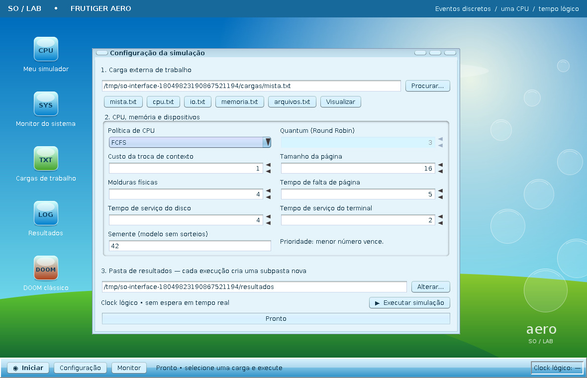
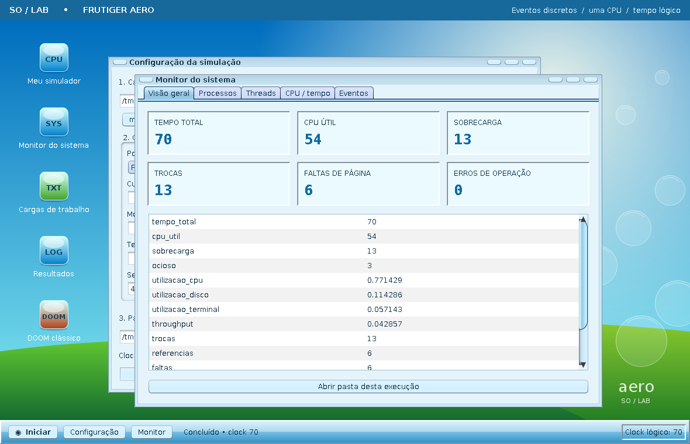

# Desktop gráfico do simulador

Swing, incluído no módulo padrão `java.desktop`, é usado para a interface. Não é
necessário JavaFX nem baixar bibliotecas. O alvo de compilação permanece Java 21.

O visual Frutiger Aero combina céu azul, colinas verdes, bolhas translúcidas,
ícones brilhantes e painéis claros. Java2D desenha o fundo e os ícones; Nimbus
apresenta os controles. A transparência é um efeito visual, sem blur nativo.
É uma inspiração visual; não inclui componentes do KDE ou do Windows.

## Abrir durante o desenvolvimento

No Windows, com Java 21 no PATH:

```powershell
powershell -ExecutionPolicy Bypass -File scripts/abrir-interface.ps1
```

No Linux/macOS, com ambiente gráfico e JDK 21:

```sh
sh scripts/abrir-interface.sh
```

## Entregar ao professor

Gere novamente o pacote com `scripts/gerar-executavel.ps1`. Abra a nova pasta de
saída em dist; pacotes gerados anteriormente não recebem mudanças automaticamente.
O professor extrai TODO o ZIP e abre `SimuladorSO.exe` ou `INICIAR.bat`.

- `SimuladorSO.exe`: interface gráfica, sem janela de console adicional.
- `SimuladorCLI.exe`: execução automatizada por argumentos, com console.
- `Testar.exe`: suíte do núcleo, já compilada.
- `MENU-CLI.bat`: menu textual anterior, mantido como alternativa.

O runtime embutido agora inclui `java.desktop`, além de `java.base`. Por isso, o
pacote gráfico tende a ser maior. O código-fonte e o repositório continuam sendo
parte da entrega acadêmica.

## Uso

1. Selecione uma das cargas prontas ou escolha outro arquivo em Procurar.
2. Escolha FCFS, RR ou PRIORIDADE; quantum é habilitado somente para RR.
3. Configure troca de contexto, páginas, molduras, falta, disco, terminal e semente.
4. Se desejar, escolha outra pasta de resultados; cada execução cria uma subpasta.
5. Clique em Executar simulação.

O monitor oferece resumo, processos, threads, linha do tempo da CPU e log
completo. Fechar uma janela interna apenas a esconde; os atalhos e a barra de
tarefas permitem reabri-la. As janelas podem ser movidas, minimizadas e ampliadas.

## Modelo preservado

`Main.executar` é o fluxo compartilhado de carga, validação, simulação e gravação.
A GUI não chama `Main.main`, para não encerrar a JVM quando há erro de entrada.
Erros viram mensagens na tela. O núcleo não depende de Swing.

`SwingWorker` executa a simulação fora da thread de apresentação, mantendo o
desktop responsivo. Isso não cria concorrência real entre processos simulados:
o núcleo continua sequencial e orientado a clock lógico. O botão Executar fica
desabilitado durante a operação; o fechamento da aplicação é adiado até o fim.
Não há cancelamento ou limite de tamanho de carga implementado.

`LinhaTempo` é uma projeção do log final: cada INSTRUCAO cobre [clock-1, clock];
os intervalos INICIO_TROCA/FIM_TROCA formam a linha Contexto. A escala representa
todo o tempo simulado. Não é reprodução ao vivo nem depurador passo a passo;
eventos exatos permanecem consultáveis no log. Cargas longas comprimem as barras.

## Validação

Em 19/09/2026, OpenJDK 21 no Windows passou nas 191 verificações do núcleo,
antes e depois do empacotamento. `TestesInterface` montou o desktop sem
janela nativa, acionou o botão de execução, verificou bloqueio de duplicação e
comparou os três CSVs de métricas com a execução pelo fluxo da CLI.

As capturas `interface-configuracao.png` e `interface-resultados.png` são da
interface real renderizada offscreen; os resultados foram calculados pela carga
mista. O alvo entregue é `--release 21`. O gerador rodou testes
offscreen e nativos de CLI, mas a abertura e a interação com a GUI no Windows
devem ser conferidas manualmente.

Prévia:




## Central de jogos

O atalho DOOM abre `PainelDoom`; `Doom` valida os arquivos e inicia Chocolate Doom
com `ProcessBuilder`. Um `SwingWorker` aguarda o término sem bloquear o desktop.
Consulte [doom.md](doom.md) para preparar os arquivos e entender os limites.
